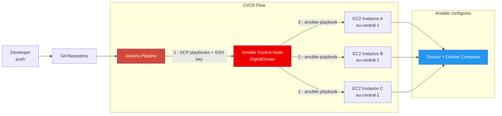

# Ansible + Jenkins CI/CD

Automated server configuration with **Ansible** triggered from a **Jenkins pipeline**. When a build runs, Jenkins copies the Ansible playbooks to a dedicated control node, then executes them remotely — installing Docker and Docker Compose on all EC2 instances discovered via dynamic inventory.

**Module 15** of the [TechWorld with Nana DevOps Bootcamp](https://www.techworld-with-nana.com/devops-bootcamp).

---

## Architecture



---

## Pipeline Stages

| Stage | What Happens |
|-------|-------------|
| **Copy files to Ansible server** | Jenkins uses `sshagent` to SCP the playbook, inventory and EC2 SSH key to the Ansible control node |
| **Execute Ansible playbook** | Jenkins SSHes into the control node, runs `prepare-ansible-server.sh` to install Ansible + boto3, then executes the playbook |

---

## Ansible Playbook

The playbook (`ansible/my-playbook.yaml`) configures all target EC2 instances:

1. **Install Docker** — via `yum`, enabled with `systemd`
2. **Install Docker Compose** — detects remote architecture with `uname -m`, downloads the matching binary to `~/.docker/cli-plugins`

Target hosts are discovered dynamically from AWS using the `aws_ec2` inventory plugin (region: `eu-central-1`), grouped by tags and instance type.

---

## Repository Structure

```
ansible-jenkins/
├── Jenkinsfile                    # Pipeline: copy files + run playbook
├── prepare-ansible-server.sh      # Bootstrap Ansible + boto3 on control node
├── ansible/
│   ├── ansible.cfg                # Disable host key checking, set remote user
│   ├── inventory_aws_ec2.yaml     # Dynamic AWS inventory (aws_ec2 plugin)
│   └── my-playbook.yaml           # Install Docker + Docker Compose on EC2s
└── src/                           # Java Maven app used as deployment target
```

---

## Key Concepts

| Concept | Implementation |
|---------|---------------|
| Ansible control node | Separate server — not Jenkins itself |
| Dynamic inventory | `aws_ec2` plugin auto-discovers instances by region and tags |
| Credential handling | SSH keys stored in Jenkins credentials store, never hardcoded |
| Remote execution | Jenkins uses `sshScript` / `sshCommand` to drive Ansible remotely |
| Idempotency | `yum` + `systemd` modules are safe to re-run — same result every time |

---

## What I Learned

- **Ansible needs its own control node, not Jenkins itself.** Jenkins orchestrates the pipeline — it copies files and triggers commands. Ansible does the actual server configuration. Mixing both on the same machine creates a coupling problem: if Jenkins is down, you lose your configuration management too.

- **Dynamic inventory removes the need for hardcoded IPs.** The `aws_ec2` plugin discovers instances automatically from the region and groups them by tags. As EC2s come and go (auto-scaling, replacements), the inventory updates itself — no manual `hosts` file to maintain.

- **`register` + Jinja2 templating makes playbooks portable.** Using `shell: uname -m` + `register: remote_arch` to capture the machine architecture, then `{{ remote_arch.stdout }}` in the download URL, means the same playbook installs the correct Docker Compose binary on both x86_64 and arm64 — without any `when:` conditionals.

- **`become: yes` is not all-or-nothing.** The Docker install play uses `become: yes` (sudo) because `yum` and `systemd` need root. The Docker Compose install doesn't — it writes to `~/.docker/cli-plugins` in the user's home directory. Applying privilege escalation only where needed is a Ansible best practice.

- **`sshScript` vs `sshCommand` in Jenkins serve different purposes.** `sshScript` uploads and runs a local script file on the remote machine — used for `prepare-ansible-server.sh`. `sshCommand` runs a one-liner directly — used for `ansible-playbook my-playbook.yaml`. Knowing the difference avoids unnecessary file transfers.

- **Jenkins credential store keeps secrets out of the codebase.** Both the Ansible server key and the EC2 SSH key are injected at runtime via `sshagent` and `withCredentials` — nothing sensitive in the `Jenkinsfile`.

---

## What I Would Change in Production

| Issue | Current | Production fix |
|-------|---------|----------------|
| **IP hardcoded twice** | `157.230.6.45` appears both in the `ANSIBLE_SERVER` env var and again inside the `remote` dict | Use the env variable consistently: `remote.host = env.ANSIBLE_SERVER` |
| **Ansible reinstalled every run** | `prepare-ansible-server.sh` runs `apt install ansible -y` on every pipeline execution, even if already installed | Check first: `ansible --version \|\| apt install ansible -y`, or bake a server image with Ansible pre-installed |
| **`host_key_checking = False`** | Disables SSH fingerprint verification — convenient for dev, but vulnerable to MITM attacks | Distribute a `known_hosts` file and set `host_key_checking = True` |
| **`shell: uname -m` is not idempotent** | The `shell` module always runs and always marks the task as "changed" | Use the Ansible built-in fact instead: `{{ ansible_architecture }}` — no shell command needed |
| **SSH key copied as a plain file** | `ssh-key.pem` is SCP'd to the Ansible server at `/root/ssh-key.pem` | Use AWS IAM instance profiles — the Ansible server gets EC2 access via role, no static key needed |
| **No Ansible roles** | The playbook is a flat task list | Package Docker installation as a reusable role (`roles/docker/`) — reusable across multiple playbooks |

---

## Related Projects

| Repo | Topics |
|------|--------|
| [devops-ci-cd-pipeline](https://github.com/RustyHammer/devops-ci-cd-pipeline) | Jenkins pipeline — build, containerize, deploy to EC2 |
| [terraform-infrastructure-as-code](https://github.com/RustyHammer/terraform-infrastructure-as-code) | Provision the EC2 instances that Ansible then configures |
| [aws-eks-kubernetes](https://github.com/RustyHammer/aws-eks-kubernetes) | Take it further — deploy to EKS instead of raw EC2 |
