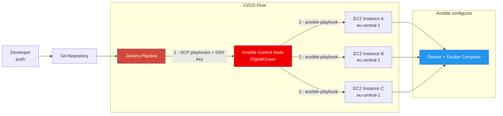

# Ansible + Jenkins CI/CD

Automated server configuration with **Ansible** triggered from a **Jenkins pipeline**. When a build runs, Jenkins copies the Ansible playbooks to a dedicated control node, then executes them remotely — installing Docker and Docker Compose on all EC2 instances discovered via dynamic inventory.

**Module 15** of the [TechWorld with Nana DevOps Bootcamp](https://www.techworld-with-nana.com/devops-bootcamp).

---

## Architecture



---

## Pipeline Stages

| Stage | What Happens |
|-------|-------------|
| **Copy files to Ansible server** | Jenkins uses `sshagent` to SCP the playbook, inventory and EC2 SSH key to the Ansible control node |
| **Execute Ansible playbook** | Jenkins SSHes into the control node, runs `prepare-ansible-server.sh` to install Ansible + boto3, then executes the playbook |

---

## Ansible Playbook

The playbook (`ansible/my-playbook.yaml`) configures all target EC2 instances:

1. **Install Docker** — via `yum`, enabled with `systemd`
2. **Install Docker Compose** — detects remote architecture, downloads the matching binary to `~/.docker/cli-plugins`

Target hosts are discovered dynamically from AWS using the `aws_ec2` inventory plugin (region: `eu-central-1`), grouped by tags and instance type.

---

## Repository Structure

```
ansible-jenkins/
├── Jenkinsfile                    # Pipeline: copy files + run playbook
├── prepare-ansible-server.sh      # Bootstrap Ansible + boto3 on control node
├── ansible/
│   ├── ansible.cfg                # Disable host key checking, set remote user
│   ├── inventory_aws_ec2.yaml     # Dynamic AWS inventory (aws_ec2 plugin)
│   └── my-playbook.yaml           # Install Docker + Docker Compose on EC2s
└── src/                           # Java Maven app used as deployment target
```

---

## Key Concepts

| Concept | Implementation |
|---------|---------------|
| Ansible control node | Separate server — not Jenkins itself |
| Dynamic inventory | `aws_ec2` plugin auto-discovers instances by region and tags |
| Credential handling | SSH keys stored in Jenkins credentials store, never hardcoded |
| Remote execution | Jenkins uses `sshScript` / `sshCommand` to drive Ansible remotely |
| Idempotency | `yum` + `systemd` modules are safe to re-run — same result every time |

---

## Related Projects

| Repo | Topics |
|------|--------|
| [devops-ci-cd-pipeline](https://github.com/RustyHammer/devops-ci-cd-pipeline) | Jenkins pipeline — build, containerize, deploy to EC2 |
| [terraform-infrastructure-as-code](https://github.com/RustyHammer/terraform-infrastructure-as-code) | Provision the EC2 instances that Ansible then configures |
| [aws-eks-kubernetes](https://github.com/RustyHammer/aws-eks-kubernetes) | Take it further — deploy to EKS instead of raw EC2 |
